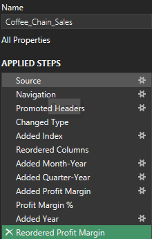
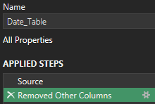
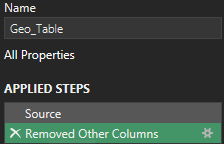
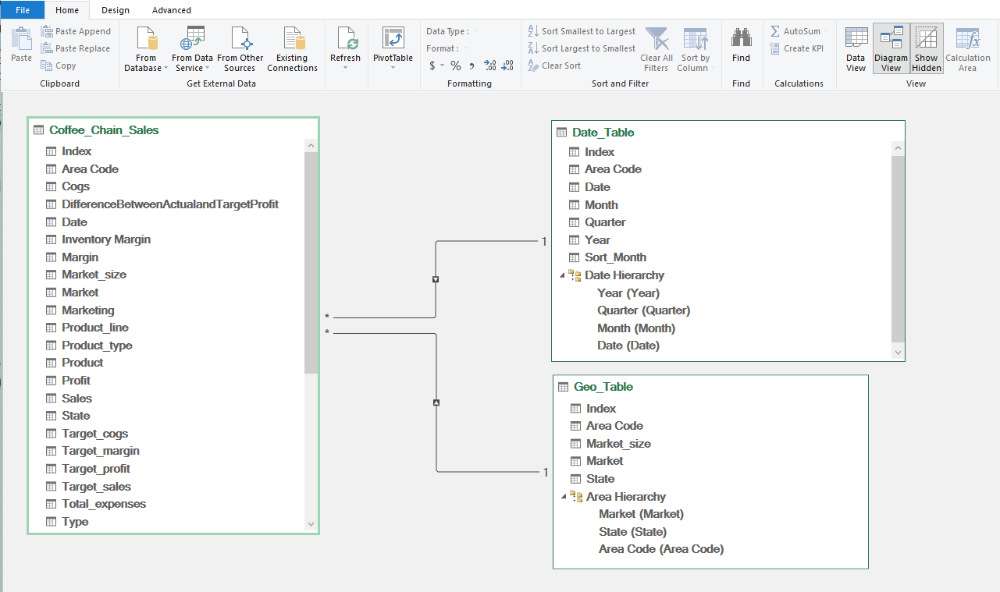
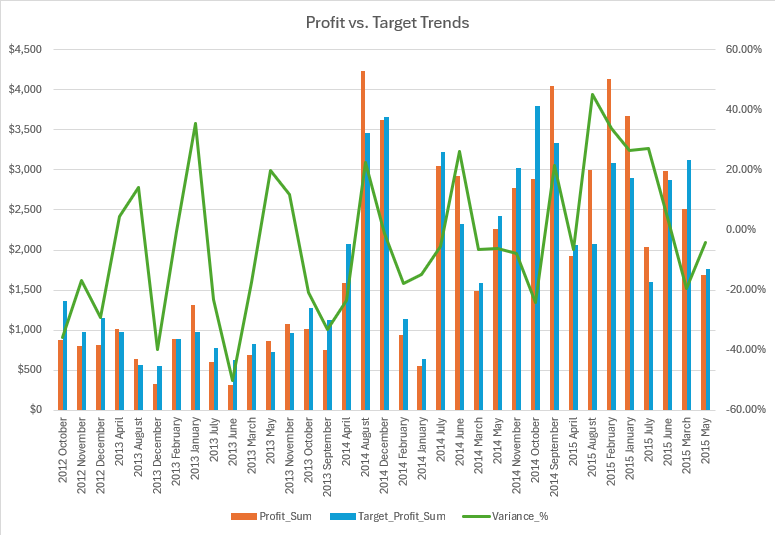
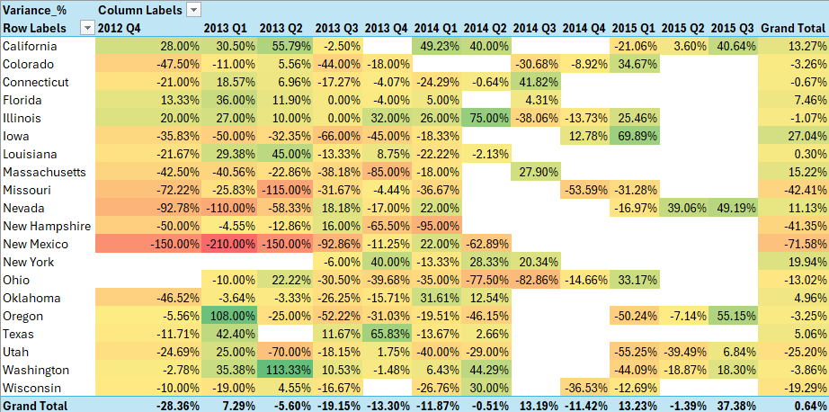
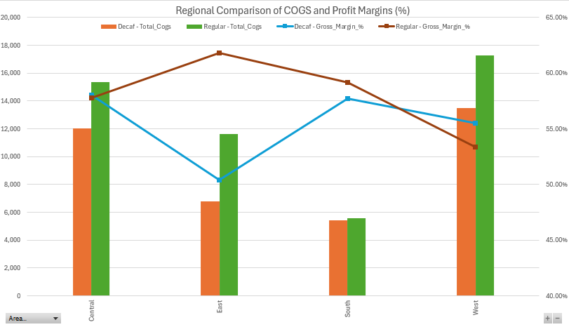
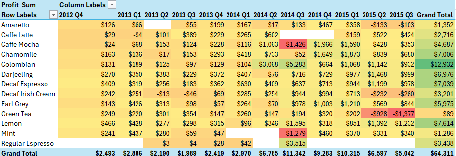

# Excel Employee Dashboard
## Overview
This project analyzes the sales performance of a coffee chain using an Excel-based dashboard.
The dataset was retrieved on [Kaggle](https://www.kaggle.com/datasets/amruthayenikonda/coffee-chain-sales-dataset) with the goal of evaluating profitability, product performance, and market trends, while comparing actual results to the business targets.

### Dashboard File
The final analysis dashboard: [Dashboard](Adv_Analysis.xlsx)

### The Dataset
- Area Code
- COGS (Cost of Goods Sold)
- Difference Between Actual and Target Profit
- Date
- Inventory Margin
- Margin (profit)
- Market Size
- Profit
- Sales

### Questions to Analyze
1. Which months and product/market combinations deviated most from the target profit?
2. Which states consistently exceed or miss targets by quarter?
3. Does decaf or regular have a better gross margin based on area?
4. Which products are the biggest profit drivers each quarter, and how does that change by state?

### Excel Skills Used
The following workbook uses the following skills:
- Pivot Tables
- Pivot Charts
- Slicers
- Power Query
- Power Pivot
- DAX (Data Analysis Expressions)
- Conditional Formatting

## Data Preparations
1. Extract
   - Using Power Query to extract the original data set ([Kaggle](https://www.kaggle.com/datasets/amruthayenikonda/coffee-chain-sales-dataset)) and create three queries
     1. First with all the coffee chain sales information
     2. Data query for sales transactions
     3. Geography query for the location of each coffee chain sales
    - **Note:** The Date and Geography queries were built manually to demonstrate Power Pivot skills.
2. Transform:
   - Transformed each query by changing the column types, remove unnecessary columns, added an index column to use as a primary key, separate the date column by year, quarter, and month for time series analysis, and reordered columns

  

3. Load:
   - Loaded all queries into the workbook
4. Power Pivot:
   - Data Model: Create relationships between the three tables using the index column and create hierarchies for the date and geography table
     
   - Power Pivot Menu: Used to refine the data model and create measures
   
## Analysis
1. Which months and product/market combinations deviated most from the target profit?
   - **Purpose:** Calculate and demonstrate the variance % between the actual profit and target profit, with monthly granularity per year for a time-series analysis. 
   - **Pivot Table:**
     - Rows: Month, created by extrating the year and month from the sale transaction date in Power Query
       ```
       Text.Combine({Text.From(Date.Year([Date])), " ", Date.MonthName([Date])})
       ```
      - Columns: Values
      - Values: DAX
        - Profit_Sum:
          ```
          =SUM(Coffee_Chain_Sales[Profit])
          ```
        - Target_Profit_Sum:
          ```
          =SUM(Coffee_Chain_Sales[Target_profit])
          ```
        - Variance_%:
          ```
          =DIVIDE([Profit_Variance], [Target_Profit_Sum])
          ```
   - **Slicers:** Year, Market, State
   - **Visualization:** The combo chart of monthly variance percentages reveals seasonality and performance gaps.
     
   - **Why it matters?** This reveals if the business is hitting their monthly goals or strategy adjustments are needed.
2. Which states consistently exceed or miss targets by quarter?
   - **Purpose:** Heat Map visual of state performance based on variance percentage.
   - **Pivot Table:**
     - Rows: State
     - Columns: Quarter, created by extracting the year and quarter from the sale transaction date in Power Query
       ```
       Text.From(Date.Year([Date])) & " " & "Q" & Text.From(Date.QuarterOfYear([Date]))
       ```
     - Values: DAX
       - Variance_%
   - **Slicer:** Market Size, Market, Product
   - **Visualization:** The heat map highlights strong performances (green) and poor performances (red)
     
   - **Why it matters?** Allows management to quickly identify which state are consistently under- or over-performing.
3. Does decaf or regular have a better gross margin based on area?
   - **Purpose:** Examine cost structure and gross margins for Regular vs Decaf across different geographic levels
   - **Pivot Table:**
     - Rows: Area Hierarchy
     - Columns: Type, Values
     - Values: DAX
       - Total_Cogs
       ```
       =SUM(Coffee_Chain_Sales[Cogs])
       ```
       - Gross_Margin_%
      ```
      =DIVIDE(([Sum_Sales] - [Total_Cogs]), [Sum_Sales])
      ```
   - **Slicer:** Year, Market Size
   - **Visualization:** Combo chart to compare margins for each region
     
   - **Why it matters?** It identifies pricing inefficiencies and cost improvement opportunities.
4. Which products are the biggest profit drivers each quarter, and how does that change by state?
   - **Purpose:** Use a heat map to demonstrate which products produce the largest absolute profit per quarter.
   - **Pivot Table:**
     - Rows: Product
     - Columns: Quarter
     - Values: DAX
       - Profit_Sum
   - **Slicer:** State, Product Type
   - **Visualization:** A heat map to highlight top profit drivers for each quarter
    
   - **Why it matters?** Helps the business understand which products are dominating based on seasonal and regional performance

## Key Takeaways
- **Seasonality:** Certain months consistently underperform target profits, maybe requiring seasonal promoions or operational adjustments
- **Regional:** The state heat map reveals which states are consistently missing targets, thereby requiring management to focus attention and resources there
- **Products:** Certain products drive the companies profit each quarter, this highlights an opportunity for targeted marketing and upselling
- **Cost:** Regular coffee generally shows slightly better margins across most markets compared to decaf, allowing for cost optimization potential
